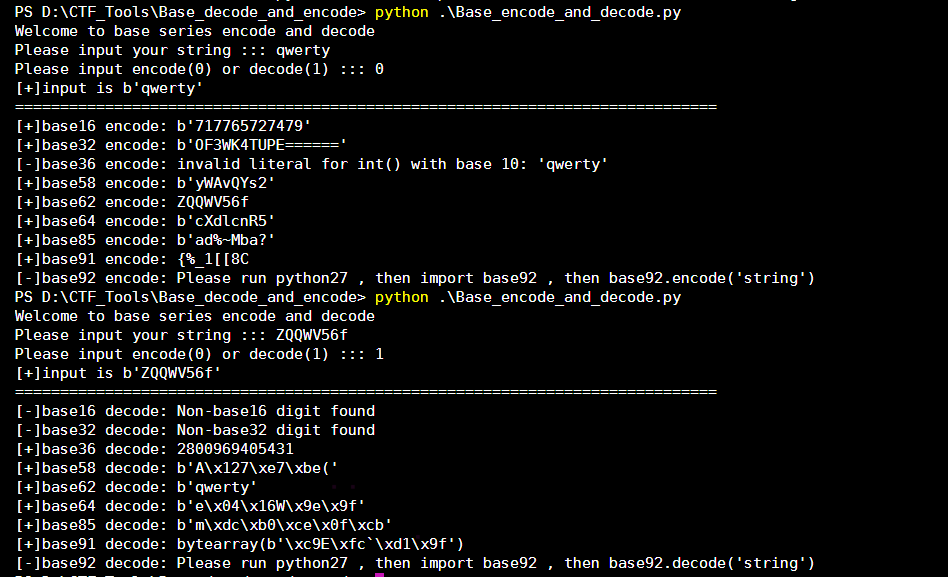

## How to use

python3

```
pip install base36
pip install base58
pip install pybase62
pip install base91

pip2 install base92
```

此脚本使用的是python3，此脚本包含了

```
base16
base32
base36
base58
base62
base64
base85
base91
```

base92的加解密请使用python2，安装`base92`包。

## Example

